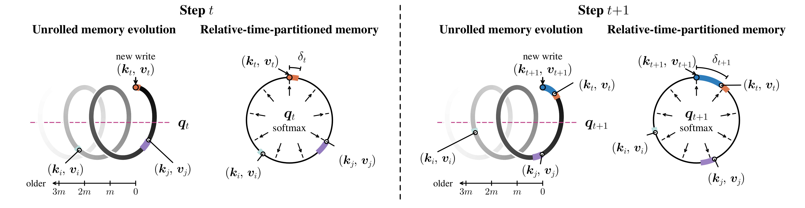
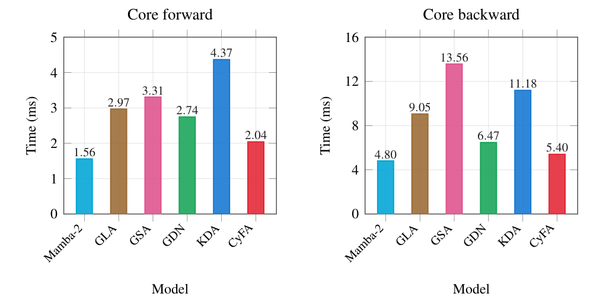

<div align="center">

# CyFA: Linear Sequence Modeling with Relative-Time-Partitioned Memory

**[Yixiao Chen](https://chyxx.github.io/) · Shuojin Yang · Shi-Min Hu**  
Tsinghua University

[](https://arxiv.org/abs/2609.36259)
[](https://huggingface.co/collections/cyxxxxxxxxxx/cyclicflowattention-6abb56dc723179dddead18b0)

</div>

Official PyTorch implementation of **Cyclic Flow Attention (CyFA)**. CyFA organizes
a fixed-size recurrent memory by relative time, combining a learned clock and
cyclic transport with content-based softmax retrieval. An exact change to
absolute-clock coordinates yields two scalar-decay recurrences, enabling
linear-time chunkwise training and constant-memory autoregressive decoding.

<p align="center">
  
</p>
<p align="center"><em>
Figure 1. CyFA advances stored associations through relative-time slots before
each new write. A learned clock controls the spacing between writes, while the
same transport keeps key and value memories aligned.
</em></p>

## Method

### Relative-time recurrence

Each head maintains aligned key and value memories. A learned clock increment
$\delta_t\in(0,1)$ transports both memories before the current pair is written
to the age-zero slot:

$$
\begin{aligned}
\mathbf K_t
&=\alpha_t\mathbf P(\delta_t)\mathbf K_{t-1}
+\beta_t\boldsymbol e_0\boldsymbol k_t^\top,\\
\mathbf V_t
&=\alpha_t\mathbf P(\delta_t)\mathbf V_{t-1}
+\beta_t\boldsymbol e_0\boldsymbol v_t^\top.
\end{aligned}
$$

Here $\mathbf P(\delta_t)$ is a fractional cyclic shift, $\alpha_t$ is a scalar
forget gate, and $\beta_t$ controls write strength. A learned matrix $\mathbf R$
combines relative-time slots during content-based retrieval:

$$
\boldsymbol o_t=(\mathbf R\mathbf V_t)^\top
\operatorname{softmax}\!\left(\mathbf R\mathbf K_t\boldsymbol q_t\right).
$$

### Absolute-clock recurrence

Let $\lambda_t=\lambda_{t-1}+\delta_t$ be the cumulative clock,
$\boldsymbol b=\boldsymbol\Phi^\top\boldsymbol e_0$, and $\mathcal U(\lambda)$ the
block-diagonal Fourier rotation associated with the cyclic shift. Moving the
state into absolute-clock coordinates removes the dense transport from the
recurrent transition exactly:

$$
\begin{aligned}
\overline{\mathbf K}_t
&=\alpha_t\overline{\mathbf K}_{t-1}
+\beta_t\mathcal U(-\lambda_t)\boldsymbol b\boldsymbol k_t^\top,\\
\overline{\mathbf V}_t
&=\alpha_t\overline{\mathbf V}_{t-1}
+\beta_t\mathcal U(-\lambda_t)\boldsymbol b\boldsymbol v_t^\top.
\end{aligned}
$$

The learned clock now controls only the temporal write vector; both stored
states advance through the scalar decay $\alpha_t$.

### Two-pass computation

The equivalent implementation consists of two scalar-gated linear-attention
passes connected by a token-wise softmax readout:

$$
\begin{aligned}
\{\boldsymbol o'_t\}_{t=1}^{T}
&=\operatorname{ScalarGatedLA}\!\left(
\{\boldsymbol q_t,\boldsymbol k_t,
\beta_t\mathcal U(-\lambda_t)\boldsymbol b,\alpha_t\}_{t=1}^{T}
\right),\\
\boldsymbol o''_t
&=\mathcal U(-\lambda_t)\boldsymbol\Phi^\top\mathbf R^\top
\operatorname{softmax}\!\left(
\mathbf R\boldsymbol\Phi\mathcal U(\lambda_t)\boldsymbol o'_t
\right),\\
\{\boldsymbol o_t\}_{t=1}^{T}
&=\operatorname{ScalarGatedLA}\!\left(
\{\boldsymbol o''_t,
\beta_t\mathcal U(-\lambda_t)\boldsymbol b,
\boldsymbol v_t,\alpha_t\}_{t=1}^{T}
\right).
\end{aligned}
$$

The first pass queries the key memory, the middle transformation produces
relative-time slot weights, and the second pass retrieves from the value
memory. Both recurrent passes admit parallel chunkwise training and fused
constant-memory decoding. The released models use 127 active slots, stored
with `num_slots=128` rows per head.

## Results and Checkpoints

Selected results from Table 2 of the paper, evaluated at a 2,048-token context.
Commonsense averages cover six zero-shot tasks; recall averages cover FDA,
SWDE, SQuAD, NQ, TriviaQA, and DROP. All scores are percentages.

| Scale | Model | Commonsense average | Recall average | FDA | SWDE |
| --- | --- | ---: | ---: | ---: | ---: |
| 400M | Transformer | 41.07 | 33.98 | 53.04 | 38.89 |
| 400M | KDA | 41.90 | 26.31 | 26.07 | 25.02 |
| 400M | CyFA | 42.47 | 33.25 | 42.60 | 35.61 |
| 800M | Transformer | 45.61 | 38.23 | 49.32 | 42.92 |
| 800M | KDA | 46.81 | 31.18 | 28.25 | 30.18 |
| 800M | CyFA | 48.16 | 37.13 | 43.69 | 40.58 |
| 1.4B | Transformer$^\dagger$ | 49.85 | 41.41 | 55.31 | 44.70 |
| 1.4B | KDA | 52.89 | 37.73 | 42.60 | 40.77 |
| 1.4B | CyFA | 53.19 | 43.47 | 57.77 | 46.58 |

$^\dagger$ Publicly released [FLA Transformer checkpoint](https://huggingface.co/fla-hub/transformer-1.3B-100B).

| Model | Config | Layers | Hidden size | Heads | Head dimension | SlimPajama tokens | Checkpoint |
| --- | --- | ---: | ---: | ---: | ---: | ---: | --- |
| CyFA-400M | [400M](configs/cyclic_flow_attention_400m.json) | 24 | 1024 | 4 | 256 | 15B | [Hugging Face](https://huggingface.co/cyxxxxxxxxxx/cyfa-400M-15B) |
| CyFA-800M | [800M](configs/cyclic_flow_attention_800m.json) | 24 | 1536 | 6 | 256 | 30B | [Hugging Face](https://huggingface.co/cyxxxxxxxxxx/cyfa-800M-30B) |
| CyFA-1.4B | [1.4B](configs/cyclic_flow_attention_1_4b.json) | 24 | 2048 | 8 | 256 | 100B | [Hugging Face](https://huggingface.co/cyxxxxxxxxxx/cyfa-1.4B-100B) |

## Core Operator Efficiency

<p align="center">
  
</p>

Core operator latency on one NVIDIA RTX PRO 6000 using the 400M training shape
($T=2048$, batch size 32). CyFA takes 2.04 ms forward and 5.40 ms backward,
respectively 46.7% and 48.3% of KDA's execution time.

## Installation

Requirements: **Linux**, **Python 3.10+**, **PyTorch 2.8+**, **Triton 3.4+**,
and an **NVIDIA GPU with BF16 support (Ampere or newer)**.

```bash
git clone https://github.com/Chyxx/CyclicFlowAttention.git
cd CyclicFlowAttention
pip install -e '.[train,eval]'
```

## Quick Start

### Generate from a checkpoint

```python
import torch
from transformers import AutoModelForCausalLM, AutoTokenizer

import cyclic_flow_attention  # registers CyFA with Transformers

checkpoint = "cyxxxxxxxxxx/cyfa-400M-15B"
tokenizer = AutoTokenizer.from_pretrained(checkpoint)
tokenizer.padding_side = "left"
if tokenizer.pad_token_id is None:
    tokenizer.pad_token = tokenizer.eos_token
model = AutoModelForCausalLM.from_pretrained(
    checkpoint,
    dtype=torch.bfloat16,
).cuda().eval()

inputs = tokenizer("The library opens at", return_tensors="pt").to("cuda")
with torch.inference_mode():
    output = model.generate(
        **inputs,
        max_new_tokens=64,
        do_sample=False,
        use_cache=True,
        pad_token_id=tokenizer.pad_token_id,
    )
print(tokenizer.decode(output[0], skip_special_tokens=True))
```

### As a layer

```python
import torch
from cyclic_flow_attention import CyclicFlowAttention

layer = CyclicFlowAttention(
    hidden_size=1024,
    num_heads=4,
    head_dim=256,
    num_slots=128,
    checkpoint_level=0,
    layer_idx=0,
).cuda().bfloat16()

x = torch.randn(1, 2048, 1024, device="cuda", dtype=torch.bfloat16)
y, _, _ = layer(x)
assert y.shape == x.shape
```

`checkpoint_level`: `0` for speed, `1` for lower activation memory.

### Initialize a causal language model

```python
from transformers import AutoModelForCausalLM
from cyclic_flow_attention import CyclicFlowAttentionConfig

config = CyclicFlowAttentionConfig.from_pretrained(
    "configs/cyclic_flow_attention_400m.json",
)
model = AutoModelForCausalLM.from_config(config)
```

## Data Preparation

```bash
python -m training.prepare_data \
  --dataset cerebras/SlimPajama-627B \
  --split train \
  --text-column text \
  --tokenizer fla-hub/gla-1.3B-100B \
  --context-length 2048 \
  --num-proc 32 \
  --map-batch-size 1000 \
  --output-dir /path/to/tokenized-dataset
```

## Training

Train CyFA-400M from scratch on one node with eight GPUs:

```bash
CUDA_VISIBLE_DEVICES=0,1,2,3,4,5,6,7 \
PYTORCH_CUDA_ALLOC_CONF=expandable_segments:True \
torchrun \
  --nnodes=1 \
  --nproc_per_node=8 \
  --rdzv_backend=c10d \
  --rdzv_endpoint=localhost:0 \
  -m training.train \
  --model_name_or_path configs/cyclic_flow_attention_400m.json \
  --tokenizer fla-hub/gla-1.3B-100B \
  --use_fast_tokenizer true \
  --from_config true \
  --do_train \
  --cache_dir /path/to/tokenized-dataset \
  --split train \
  --varlen false \
  --dataloader_num_workers 4 \
  --output_dir outputs/cyfa-400m \
  --logging_strategy steps \
  --logging_steps 32 \
  --include_num_input_tokens_seen \
  --save_strategy steps \
  --save_steps 1024 \
  --save_total_limit 1 \
  --optim adamw_torch_fused \
  --learning_rate 3e-4 \
  --lr_scheduler_type cosine_with_min_lr \
  --lr_scheduler_kwargs '{"min_lr_rate":0.1}' \
  --warmup_steps 1024 \
  --weight_decay 0.01 \
  --adam_beta1 0.9 \
  --adam_beta2 0.95 \
  --adam_epsilon 1e-8 \
  --max_grad_norm 1.0 \
  --max_steps 30720 \
  --per_device_train_batch_size 32 \
  --gradient_accumulation_steps 1 \
  --seed 42 \
  --bf16 \
  --report_to none \
  --fsdp "full_shard auto_wrap" \
  --fsdp_config '{"version":2,"reshard_after_forward":false,"cpu_ram_efficient_loading":false}'
```

Use the following values for the other model scales:

| Model | Config | Per-device batch | Accumulation | Global batch (sequences) | Steps |
| --- | --- | ---: | ---: | ---: | ---: |
| 400M | `configs/cyclic_flow_attention_400m.json` | 32 | 1 | 256 | 30,720 |
| 800M | `configs/cyclic_flow_attention_800m.json` | 16 | 2 | 256 | 61,440 |
| 1.4B | `configs/cyclic_flow_attention_1_4b.json` | 16 | 4 | 512 | 102,400 |

The same recipe is available through the launcher:

```bash
DATASET_PATH=/path/to/tokenized-dataset \
OUTPUT_DIR=outputs/cyfa-400m \
NGPU=8 bash scripts/train.sh
```

## Evaluation

```bash
export CHECKPOINT=/path/to/checkpoint
```

### Language modeling and commonsense reasoning

```bash
python -m eval.lm_eval \
  --model-path "$CHECKPOINT" \
  --tasks "arc_easy,arc_challenge,hellaswag,lambada_standard,piqa,winogrande,wikitext" \
  --device cuda:0 \
  --dtype bfloat16 \
  --batch-size 32 \
  --max-length 2048 \
  --num-fewshot 0 \
  --output-path results/lm
```

The commonsense average uses `acc_norm` for ARC-Challenge and HellaSwag, and `acc` for ARC-Easy,
LAMBADA, PIQA, and WinoGrande. WikiText perplexity is reported separately.

### Recall-intensive tasks

```bash
python -m eval.recall_eval \
  --model-path "$CHECKPOINT" \
  --tasks "based_fda,based_swde,based_squad,based_nq_2048,based_triviaqa,based_drop" \
  --device cuda:0 \
  --dtype bfloat16 \
  --batch-size 32 \
  --context-length 2048 \
  --answer-length 48 \
  --output-path results/recall
```

Recall evaluation uses zero-shot greedy generation, stopping at a newline or
after 48 generated tokens.

## License

CyclicFlowAttention is released under the [MIT License](LICENSE).

## Acknowledgements

This repository is built upon [Flash Linear Attention](https://github.com/fla-org/flash-linear-attention)
and [Prefix Linear Attention](https://github.com/HazyResearch/prefix-linear-attention).
We thank their authors for making their code publicly available.

## Citation

```bibtex
@article{chen2026cyfa,
  title={CyFA: Linear Sequence Modeling with Relative-Time-Partitioned Memory},
  author={Chen, Yixiao and Yang, Shuojin and Hu, Shi-Min},
  journal={arXiv preprint arXiv:ARXIV_ID},
  year={2026}
}
```
